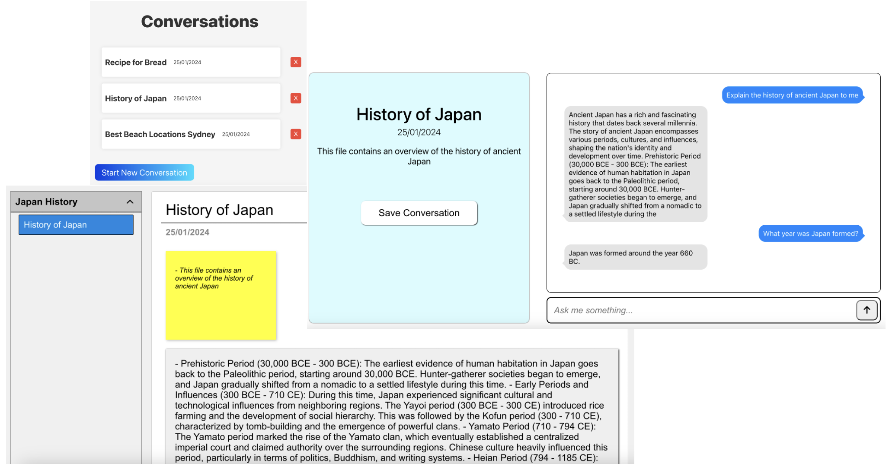

NoteItAi - Chatbot & Notes Web App

Overview
Welcome to the ChatBot Conversations Web App! This web application allows users to interact with an AI chatbot, save their conversations, and organize them into folders with associated notes. Users can manage their conversations, notes, files, and folders efficiently, making it a versatile tool for keeping track of information.

Getting Started
To get started with the ChatBot Conversations Web App, follow these steps:

- Head to the "Chat" section to initiate a conversation with the AI chatbot
- Once you've named and started your conversation you can ask the chatbot any question you need answered
- When you feel the chatbots answered enough questions you can save the conversation to a note, specifying the notes name and folder to be stored in
- Once saved you can then navigate to the conversations page
- On the conversations page you will find all your previous chats stored in folders
- If you open a previous chat you will see it has been summarised and formatted nicely. You can now use these notes for study and revision
- You can also edit, delete or save any of the notes you create
